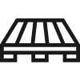

<div align="center">



# Pallet

[](https://github.com/nylar/pallet/actions)
[](https://github.com/nylar/pallet#license)

A private registry and API for Rust.
</div>

## Installation

Pallet comes with the following storage backends that must be selected at compile-time:

* Local (files are stored and served from a directory).
* S3 (files are stored and served from an S3 bucket).

### Building from source

Pallet requires `rust` and the requirements listed below. A storage feature must be selected (either `local` or `s3`).

```shell
cargo build --release --features STORAGE_BACKEND
```

### Docker

The `docker` directory has a `Dockerfile` for each storage backend. These are also available from the Docker registry.

### Requirements

* `libssl-dev`
* `libpq-dev`

## Database

Pallet currently requires a Postgresql database for storing owners and crate information. The migrations require the `diesel_cli` tool:

```shell
cargo install diesel_cli --no-default-features --features postgres
```

The migrations can then be run with:

```shell
DATABASE_URL=POSTGRES_DSN diesel migration run
```

## Usage

To interact with the Pallet API via Cargo, you will need to create an owner and a token, information on how to do that can be found in the sections below. Once you have a token generated by Pallet, you can run `cargo login --registry=NAME_OF_REGISTRY`. This will prompt you to visit `/me`, however, you already have a token and can paste that into the prompt.

A token can also be supplied as an environment variable or as a flag to `cargo` subcommands.

### Owners

Owners are currently created using the `pallet` binary by using the `create_owner` subcommand.

### Tokens

Tokens are currently created using the `pallet` binary by using the `create_token` subcommand. An owner is required before you can create a token. The token can either be used with `cargo login` or passed in as an environment variable/flag when running commands that require authorisation.

### Publishing

A token is required to publish a crate. When a crate is first pushed, the owner associated with the token publishing the crate will be the sole owner of the crate. Owners can be added/listed/removed from a crate using the `cargo owner` [subcommand](https://doc.rust-lang.org/cargo/commands/cargo-owner.html). A crate can be published using the `cargo publish` [subcommand](https://doc.rust-lang.org/cargo/commands/cargo-publish.html). You may either pass a registry as an environment variable/flag or add it to the `Cargo.toml` manifest:

```toml
[package]
# ...
publish = ["NAME_OF_REGISTRY"]
```

### Yanking/Unyanking

A crate version can be yanked or unyanked using the `cargo yank` [subcommand](https://doc.rust-lang.org/cargo/commands/cargo-yank.html). A token for an owner of the crate is required to yank/unyank a crate version. A crate version can be unyanked using the `--undo` flag.

## License

Licensed under either of

- Apache License, Version 2.0 ([LICENSE-APACHE](LICENSE-APACHE) or http://www.apache.org/licenses/LICENSE-2.0)
- MIT license ([LICENSE-MIT](LICENSE-MIT) or http://opensource.org/licenses/MIT)

at your option.
